# rigol-oscilloscope-and-generator
 matlab app to control rigol oscilloscope and generator
## 一 简介
本程序是基于SCPI指令的matlab APP，可用于rigol公司生产的的示波器&信号发生器的远程控制。

## 二 环境配置
- Matlab（需支持matlab app）；
- Matlab的信号分析器工具箱；
- Ultra Sigma软件（安装包可通过rigol官网下载，此外screenshot补丁文件需要另外下载并配置以支持截图功能）；

## 三 设备
测试使用示波器为Rigol DS2000A, 信号发生器为DG4000。原则上可以支持所有满足环境要求的rigol产示波器和信号发生器。

## 四 如何连接
可以通过 USB、LAN 或 GPIB（配合 RIGOL 的 USB-GPIB 接口模块等仪器总线与 PC进行通信。

## 五 示波器远程控制APP
### 关于程序
在示波器文件夹下包含的“DS2022A”文件实现了示波器类，类中实现了示波器远程控制的各种方法。“scope.mlapp文件中使用 DS2022A 类实现了相应的GUI。

### GUI界面
界面与功能如下图所示。其中的功能介绍如下：
- **“open-close”按钮:** 左下角，用于打开-关闭连接，每次使用远程控制的开始和结束都要操作此按钮。
-	**“Menu”模块:** 包括示波器的一些基本操作，如自动调整（auto）等，和一些高级功能，如“Advanced”(使用信号分析器)，“Screenshot”(截图)。
-	**“Horzontal”和“Vertical模块”:** 用于操作波形的水平和垂直位置和尺度，操作和示波器的几乎一样，唯一的不同在于当“vertical”的旋钮拧到底时需要用“knob reset”复位。
 

   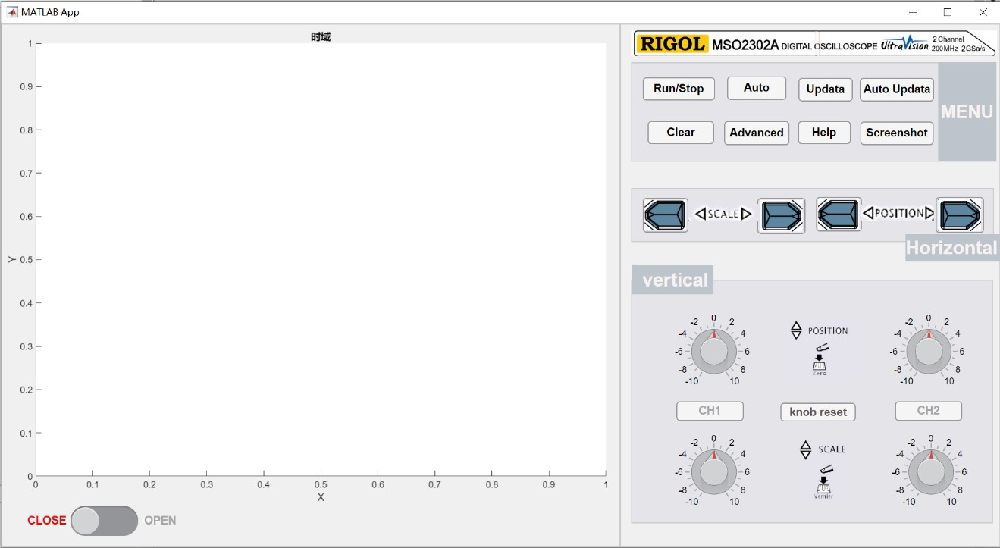
 

 
 ## 实例演示：使用GUI观察方波
 注意第一次连接某仪器前需要复制Ultra Sigma中的端口地址并在程序中修改，如下图所示。
 

   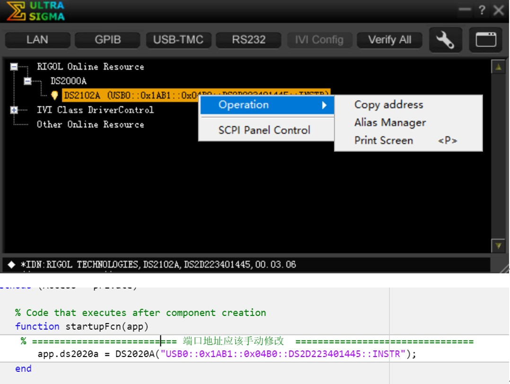
 

 首先打开左下角的开关，连接仪器，“open”字样会变亮，说明连接成功。  
 
将示波器通道1接入方波，之后在GUI界面依次点击：“Run/Stop”→ “Auto-Updata”(自动同步屏幕的波形) → “CH1”（打开CH1通道）→ “Auto”(自动调整) ，即可观察波形，如下图所示。

   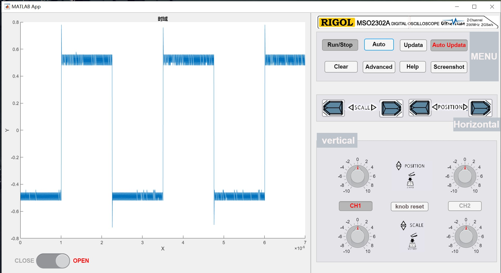
   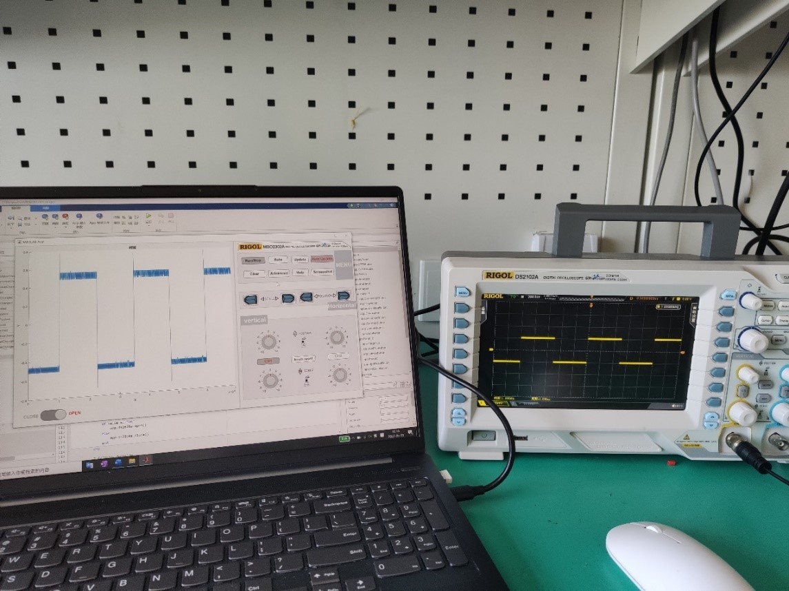
 

可以在“Horzontal”和“Vertical”区调整水平和垂直的尺度和位置，更方便的观察。

点击“Advancced”可以调用信号分析器工具箱分析波形。例如，我们先测量一下方波的频谱，见下图。 信号工具箱可以实现的操作还有很多，如包络检波、滤波、去噪等，也可以自定义相关函数对信号进行处理。
 

   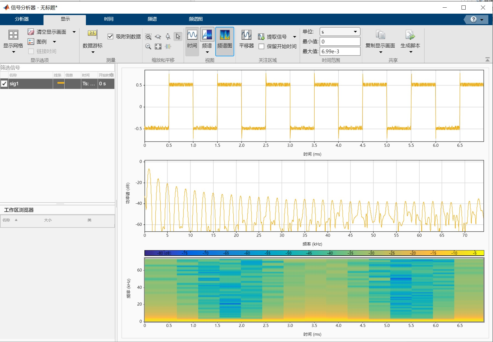
 

  
 按下“screenshot”键，matlab将会打开Ultra Sigma程序，在程序中右键示波器使用截图功能（前提是要下载screenshot补丁，并且需要将程序中的文件路径改成Ultra Sigma的安装路径），即可对示波器的画面进行实时截图，见下图。
  

   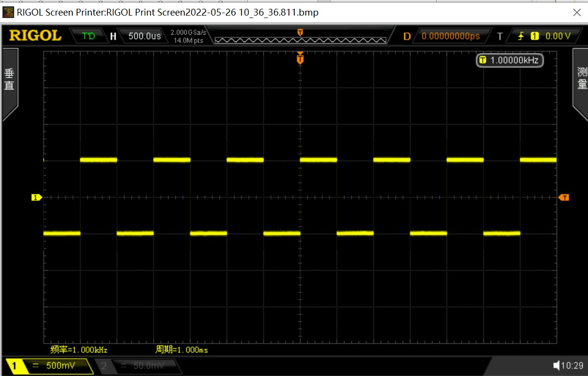
 

 
 当结束使用时，记得关闭左下角的按钮，断开连接，否则下一次的连接可能会报错。
 
 ## 六 波形发生器远程控制APP
 ### 关于程序
 在示波器文件夹下包含的“DG4000”文件实现了波形发生器类，类中实现了波形发生器远程控制的各种方法。“Generate.mlapp文件中使用 DG4000 类实现了相应的GUI。
 
 ### GUI界面
 界面见下图，该程序支持双通道正弦波、方波、三角波的生成以及AM、FM调制。
 

   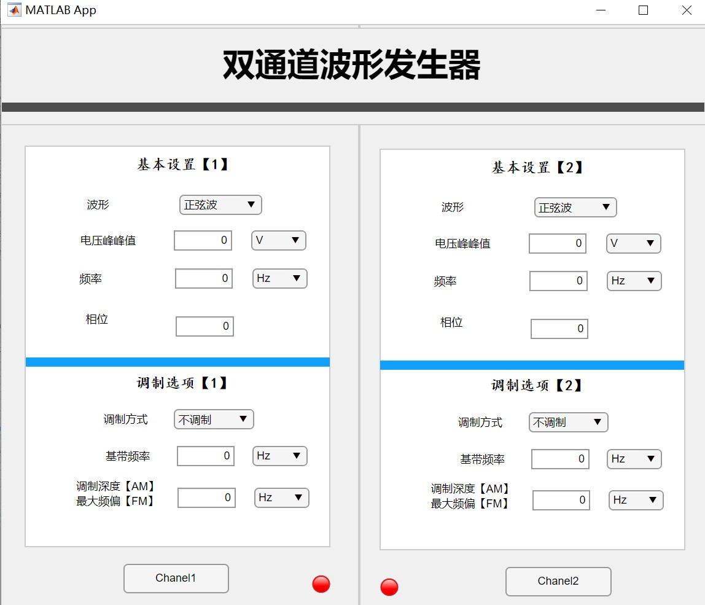
 

 
 ### 演示1：三角波生成
 这里仍然注意，使用前需要修改端口地址。
 
 不同于上一个程序，这里打开后将会直接进行连接，如果打开时未连接程序会报错。设置好参数后按下”channel1”, 观察到指示灯由红变绿，说明通道1成功输出波形。
  

   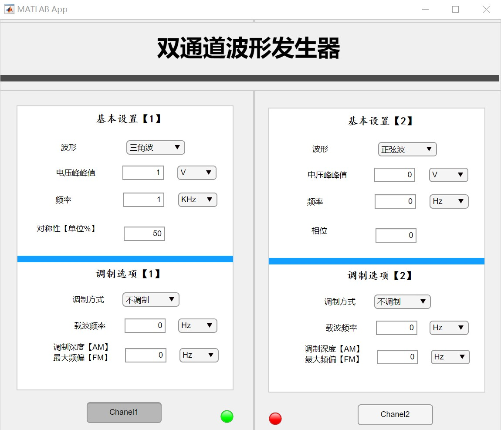
   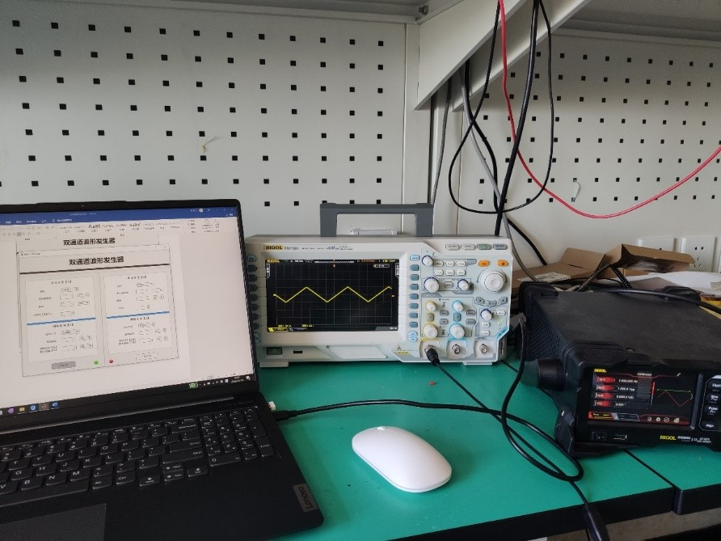
 

 
  ### 演示2：AM信号生成
  按照说明设置好参数，注意使用AM信号时，调制深度栏的单位默认为%。按下通道键即可产生AM信号波形。
   

   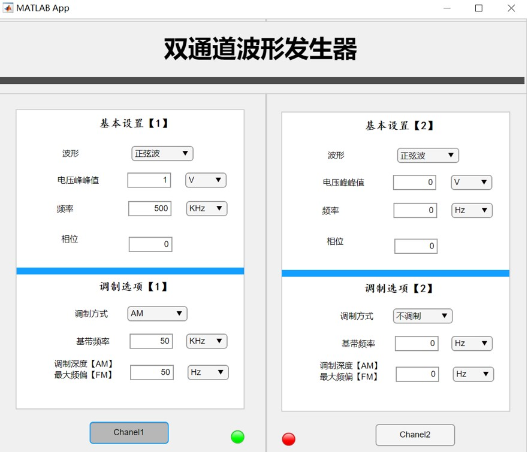
   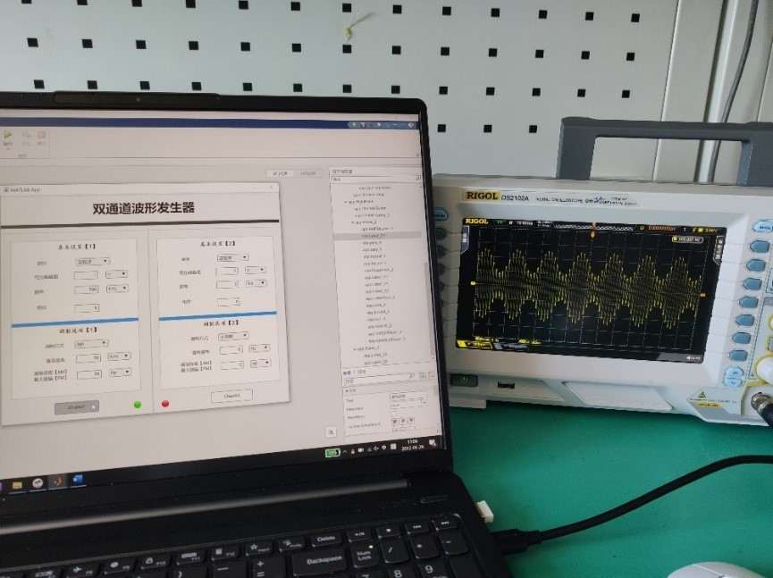
 

## 七 说明
- 该程序仅供学习之用；
- 如果存在侵权，请在issue中反映，以便及时修改；
